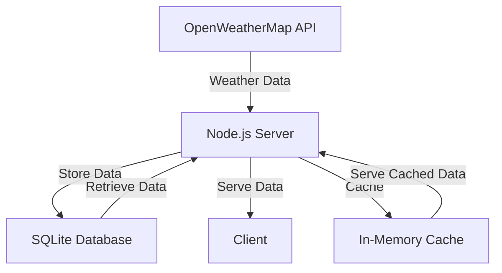

# backend-service
Technical challenge that collects and stores weather data from OpenWeatherMap API.

### Setup:
1. Prerequisites
   - Node.js installed (latest LTS version recommended)
   - npm or yarn package manager

2. Installation
   ```bash
   # Clone the repository
   git clone https://github.com/maxxcyang/Weather-App
   cd Weather-App

   # Install dependencies
   npm install
   ```

3. Environment Configuration
   Create a `.env` file in the root directory with:
   ```
   OPENWEATHERMAP_API_KEY=your_api_key_here
   ```
   Get your API key from [OpenWeatherMap](https://openweathermap.org/api)

4. Running the Application
   ```bash
   # Development mode
   npm run dev

   # Or build and run
   npm run build
   npm start
   ```

The server should now be running on `http://localhost:3000` (or your configured port)

Note: Make sure to replace `your_api_key_here` with your actual OpenWeatherMap API key.

## Architecture Overview

### Core Components

1. **API Layer**
   - OpenWeatherMap API integration
   - Handles external weather data fetching
   - Manages API key authentication
   - Implements retry policies and rate limit handling
   - Automatic rate limit detection and backoff

2. **Database Layer**
   - SQLite database for local storage
   - Stores weather data for multiple cities
   - Handles data persistence
   - Implements caching and batch operations
   - Optimized query performance with indexes

3. **Server Components**
   - Node.js backend server
   - TypeScript for type safety
   - Axios for HTTP requests
   - Connection pooling for database operations

### Data Flow



### Key Features
1. **Weather Data Collection**
   - Current weather conditions
   - Hourly forecasts
   - Multiple city support
   - Temperature, humidity, UV index tracking
   - Automatic retry on API failures
   - Rate limit handling and backoff

2. **Data Storage**
   - Local SQLite database
   - Persistent storage
   - Single-user focused
   - In-memory caching (5-minute TTL)
   - Batch operations for bulk inserts
   - Optimized query performance

3. **City Management**
   - Hardcoded city list
   - Support for:
     - New York City
     - Beijing
     - London
     - Tokyo

### Technical Stack
- Backend: Node.js with TypeScript
- Database: SQLite
- HTTP Client: Axios
- Runtime: ts-node
- Caching: In-memory Map
- Rate Limiting: Custom implementation

### Design Decisions
This project is designed to be a lightweight, single-user backend service for fetching, storing, and serving weather data from the OpenWeatherMap API. The decisions made reflect simplicity, rapid development, and ease of local testing.

---

### 1. **Language & Runtime: Node.js + TypeScript**
- **Why Node.js?**
  - Fast startup, minimal boilerplate.
  - Rich ecosystem for HTTP and API integration.
- **Why TypeScript?**
  - Adds type safety and better developer tooling.
  - Helps prevent runtime errors and improves maintainability.

---

### 2. **Database: SQLite**
- **Why SQLite?**
  - Zero setup — just a local `.db` file, no server required.
  - Ideal for small-scale, single-user applications or prototypes.
- **Performance Optimizations:**
  - Connection pooling for better resource management
  - Batch operations for efficient bulk inserts
  - Indexes for faster query performance
  - In-memory caching to reduce database load

---

### 3. **API Integration**
- **Retry Policies:**
  - Maximum 3 retry attempts
  - Exponential backoff between retries
  - Automatic handling of rate limits
- **Rate Limit Handling:**
  - Tracks API usage limits
  - Implements automatic backoff
  - Prevents API key blacklisting

---

### 4. **Caching Strategy**
- **In-Memory Cache:**
  - 5-minute TTL for weather data
  - Automatic cache invalidation
  - Reduces database load
  - Improves response times

---

### 5. **Environment Variables**
- **Why use `.env` for the API key?**
  - Keeps sensitive information out of source control.
  - Enables safe and easy configuration across environments.

---

### 6. **Build & Run**
- **Dev Mode**: `ts-node` allows fast iteration without needing to compile.
- **Prod Mode**: Compiled with TypeScript, run with Node for better performance and safety in deployment.

---

### 7. **Serving & Static Files**
- Uses Express to serve:
  - API routes (`/api/weather`, `/api/weather/history`)
  - Static front-end files from the `public/` directory (e.g. `index.html`)
